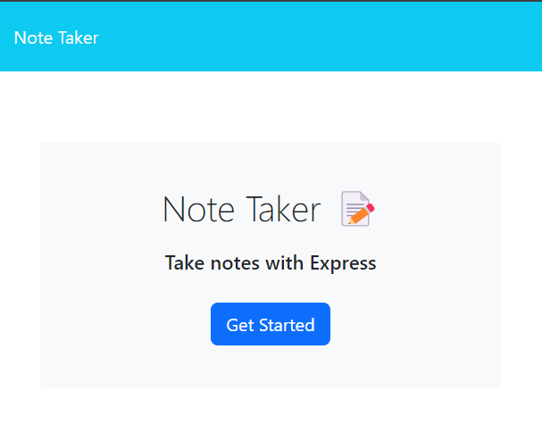
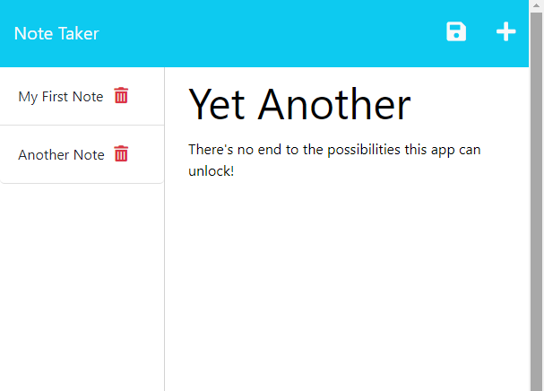

# Jot-it Notes

## Description
A note-taking app built with NodeJs, Express, and HTML.
Store your notes in a JSON file in the server.

## Table of Contents (Optional)
  
- [Installation](#installation)
- [Usage](#usage)
- [How to contribute](#how-to-contribute)
- [Questions](#questions)
- [License](#license)
  
## Installation
The app can be installed locally by cloning the [Github Repository](https://github.com/ag-bootcamp-umn/jot-it-notes).

To access the app without installation, use the [Heroku deployment](https://jot-it-notes-a8f6eb8bda87.herokuapp.com/).

## Usage
From the Start Page, click the "Get Started" button to visit the notes page.
In the notes page, click on the input fields marked with the words "Note Title" and "Note Text". 

Once both fields contain text, a save icon will appear in the top-right corner. Click this to save your note. Titles of saved notes will appear in the left-hand column. To see the content of the note, click the title and the entire note will appear in the input area.

To add a new note, at any point, click the 'plus' icon, also located in the top-right corner of the app.

To delete a note at any time, click the trash icon next to the note title in the notes list on the left side of the page.

## Screenshots

## How to Contribute
Should you wish to contribute to this humble project, I would normally suggest that you reach out to me at the contact info below, and send a pull request. However, this is homework for a coding bootcamp, and I only wish to submit my own work.

## Tests
There are no current tests available for this app.

## Questions
email: [alexgeorgegeer@gmail.com](alexgeorgegeer@gmail.com)
Github: [ag-bootcamp-umn](https://github.com/ag-bootcamp-umn)

## License
Licensed under the [MIT](https://opensource.org/license/mit/) license.